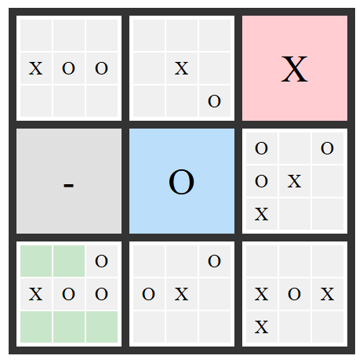

# Ultimate Tic Tac Toe - WLAN

**Ultimate Tic Tac Toe** is a strategic and advanced version of the classic Tic Tac Toe game. This project implements a game for two players, allowing them to search for opponents over a wireless local area network and compete against each other.

## How It Works
1. The game begins with an empty 3x3 grid of Tic Tac Toe boards.
2. Players take turns placing their mark (`X` or `O`) on one of the smaller boards.
3. The position of the mark determines which board the opponent must play on next.
   - For example, placing a mark in the top-left cell of a small board directs the opponent to play on the top-left board in the larger grid.
4. To win:
   - Claim three boards in a row (horizontal, vertical, or diagonal) on the larger grid.

## Getting the code

You can download a copy of all the files in this repository by cloning the git repository:

    git clone https://github.com/huynguyentuank22/CO309B_Computer_Network_mr.git

## Setup environment

You'll need a working Python environment to run the code.
Activate the virtual environment by running:

    source env/bin/activate // For Linux
    env\Scripts\activate // For Windows

Run pip to install dependencies.

    pip install -r requirements.txt

## Requirements
- Turn off the firewall before running.
- Connect to the same Wi-Fi 

## Running application

    python app.py

## Technology
<code></code>